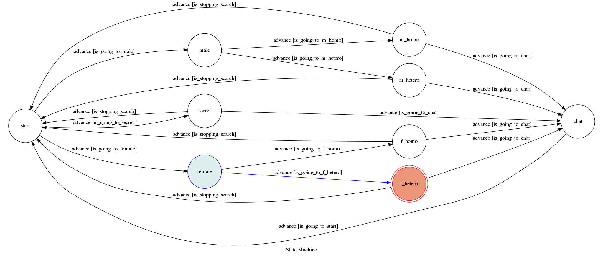

# o4o4_bot
A telegram bot based on a finite state machine.

This program is able to match two strangers by conditions to have a chat.

## Setup
* [TOC-Project-2017](https://github.com/Lee-W/TOC-Project-2017)

## Secret Data
`API_TOKEN` and `WEBHOOK_URL` in app.py **MUST** be set to proper values.
Otherwise, you might not be able to run your code.

## Run Locally
You can either setup https server or using `ngrok` as a proxy.

**`ngrok` would be used in the following instruction**
```sh
ngrok http 5000
```

After that, `ngrok` would generate a https URL.

You should set `WEBHOOK_URL` (in app.py) to `your-https-URL/hook`.

#### Run the server

```sh
python3 app.py
```

## Finite State Machine


## Usage
After sending the first message to the bot,

it will ask you to choose your gender and that of the person you want to chat with by buttons.

When the settings are all done,

it will automatically match another user that satisfies your conditions to have a chat with you.

In addition,

You can always use the commands to leave the chat or to stop the matching process.
